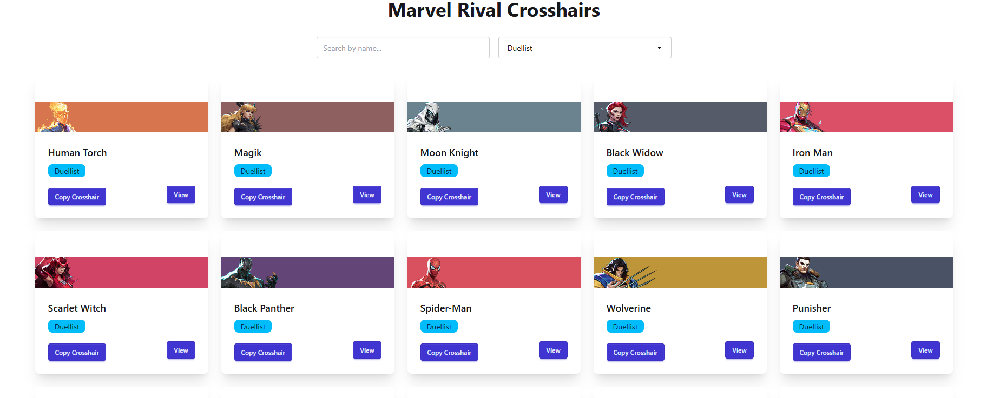

# 🦸‍♂️ Marvel Rivals Crosshair Showcase

A React + Vite web app styled with Tailwind CSS that displays Marvel Rivals characters in stylish cards. Each card shows the character's name, image, and a crosshair configuration code with copy functionality. Clicking on a card opens a modal with more detailed info and an image.

## 🚀 Tech Stack

- **Frontend**: React + Vite
- **Styling**: Tailwind CSS + DaisyUI
- **State Management**: React Hooks
- **UI Features**: Modal, Clipboard Copy

## ✨ Features

- 🃏 Display Marvel Rivals characters in responsive cards  
- 🎯 Show crosshair configuration code for each character  
- 🔍 Search Character and Filter By Category(Duelist,Support etc) 
- 📋 One-click "Copy to Clipboard" functionality  
- 🔍 Modal popup with detailed view and image  
- 💡 Clean, modern, and responsive UI using Tailwind & DaisyUI  

